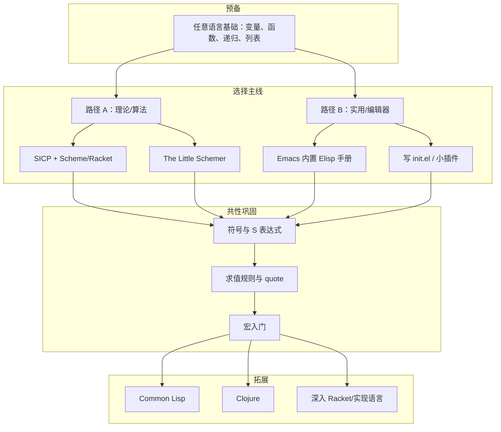

# Lisp 家族系统学习路径与资源报告

## 一、Lisp 家族概览

```
                    Lisp (1958 McCarthy)
                            │
        ┌───────────────────┼───────────────────┐
        ▼                   ▼                   ▼
   Scheme (1975)      Common Lisp (1984)    Emacs Lisp (1985)
   简洁、标准、教学        工业级、ANSI 标准        编辑器扩展、实用
        │                   │                   │
        └───────────────────┼───────────────────┘
                            │
                    Clojure (2007, JVM) / Racket 等
```

| 语言 | 典型用途 | 建议学习顺序 |
|------|----------|--------------|
| **Scheme** | 教学、算法、形式语义、Racket 生态 | ① 入门首选 |
| **Emacs Lisp (Elisp)** | 配置/扩展 Emacs、日常脚本 | ② 或与 Scheme 并行 |
| **Common Lisp** | 大型项目、工业开发、AI 历史 | ③ 进阶 |
| **Clojure** | JVM 生产、函数式 + 不可变数据 | ④ 可选 |
| **Racket** | 教学、DSL、语言实现 | 可与 Scheme 视为一体 |

---

## 二、学习路径流程图（文字版）

```
┌─────────────────────────────────────────────────────────────────┐
│ 阶段 0：预备                                                     │
│ • 任一编程基础（变量、函数、递归、列表）即可                       │
│ • 可选：SICP 前几章（Scheme）或直接 Elisp 上手                   │
└────────────────────────────┬────────────────────────────────────┘
                             ▼
┌─────────────────────────────────────────────────────────────────┐
│ 阶段 1：选一条主线                                               │
└────────────────────────────┬────────────────────────────────────┘
                             │
         ┌───────────────────┴───────────────────┐
         ▼                                         ▼
┌─────────────────────┐                 ┌─────────────────────┐
│ 路径 A：理论/算法   │                 │ 路径 B：实用/编辑器 │
│ 以 Scheme 为核心    │                 │ 以 Elisp 为核心      │
└──────────┬──────────┘                 └──────────┬──────────┘
           │                                        │
           ▼                                        ▼
┌─────────────────────┐                 ┌─────────────────────┐
│ • SICP (书+视频)     │                 │ • Emacs 内 C-h i    │
│ • Racket + DrRacket │                 │   (Elisp 手册)      │
│ • The Little Schemer│                 │ • 配置 init.el      │
└──────────┬──────────┘                 └──────────┬──────────┘
           │                                        │
           └───────────────────┬────────────────────┘
                               ▼
┌─────────────────────────────────────────────────────────────────┐
│ 阶段 2：巩固「Lisp 共性」                                        │
│ • 符号、S 表达式、quote / 求值                                   │
│ • 宏（macro）基础 → 语法抽象                                     │
│ • 一门深入：Scheme 写解释器 或 Elisp 写 mode/包                 │
└────────────────────────────┬────────────────────────────────────┘
                             ▼
┌─────────────────────────────────────────────────────────────────┐
│ 阶段 3：拓展（按兴趣选）                                         │
│ • Common Lisp：Practical Common Lisp + Quicklisp                 │
│ • Clojure：Clojure for the Brave and True                        │
│ • Racket：How to Design Programs (HtDP) / 语言实现               │
└─────────────────────────────────────────────────────────────────┘
```

---

## 三、经典学习资源

### 1. Scheme / 通用 Lisp 思维

| 资源 | 类型 | 说明 |
|------|------|------|
| **SICP**（Structure and Interpretation of Computer Programs） | 书 + 免费在线 | 经典中的经典，用 Scheme；MIT 6.001 教材，有中译《计算机程序的构造与解释》 |
| **SICP 视频** | 视频 | MIT 6.001 老版（Abelson）、Berkeley CS61A（ Garcia）可配合 SICP |
| **The Little Schemer** | 书 | 递归与列表思维，对话式、短小 |
| **The Seasoned Schemer** | 书 | Little Schemer 续集，更深 |
| **Racket 官网** https://racket-lang.org | 网站/环境 | 安装 Racket + DrRacket，用 #lang racket 写 Scheme 方言，文档齐全 |
| **Scheme 语言标准** (R7RS 等) | 文档 | https://scheme-reports.org |

### 2. Emacs Lisp

| 资源 | 类型 | 说明 |
|------|------|------|
| **Emacs 内置手册** | 文档 | 在 Emacs 内 `C-h i` → 选 “Emacs Lisp Intro” 和 “Elisp” |
| **An Introduction to Programming in Emacs Lisp** (GNU) | 书/在线 | https://www.gnu.org/software/emacs/manual/html_node/eintrop/ ，入门友好 |
| **Emacs Lisp Reference** | 文档 | `C-h i` → Elisp，查函数/变量 |
| **Mastering Emacs** (Mickey Petersen) | 书/网站 | 偏使用与工作流，也涉及 Elisp |
| **Doom / Emacs 配置源码** | 代码 | 读 `init.el`、模块里的 `.el`，实战感强 |

### 3. Common Lisp

| 资源 | 类型 | 说明 |
|------|------|------|
| **Practical Common Lisp** (Peter Seibel) | 书/免费在线 | http://www.gigamonkeys.com/book/ ，实战向 |
| **Common Lisp: A Gentle Introduction** (Touretzky) | 书 | 入门温和 |
| **Land of Lisp** (Conrad Barski) | 书 | 轻松、带游戏项目 |
| **Quicklisp** | 库管理 | https://www.quicklisp.org/ ，CL 生态入口 |
| **Hyperspec** (CLHS) | 标准 | http://www.lispworks.com/documentation/HyperSpec/Front/index.htm |

### 4. Clojure

| 资源 | 类型 | 说明 |
|------|------|------|
| **Clojure for the Brave and True** | 书/免费在线 | https://www.braveclojure.com/ ，风格活泼 |
| **Clojure 官方文档** | 网站 | https://clojure.org |
| **ClojureDocs** | 社区文档 | 示例丰富，查函数用 |

### 5. Racket（Scheme 方言 + 教学语言）

| 资源 | 类型 | 说明 |
|------|------|------|
| **How to Design Programs (HtDP)** | 书/在线 | https://htdp.org/ ，设计思路与 SICP 互补 |
| **Racket Guide / Reference** | 官方文档 | https://docs.racket-lang.org/ |
| **Programming Languages (Dan Grossman)** | 视频 | Coursera，用 ML、Racket、Ruby，讲语义 |

---

## 四、流程图（Mermaid，可在支持 Mermaid 的编辑器中渲染）



---

## 五、建议时间线（粗略）

| 阶段 | 内容 | 建议时长 |
|------|------|----------|
| 入门 | 选 Scheme 或 Elisp 其一，完成一本入门书/手册 | 4–8 周 |
| 巩固 | 做小项目（解释器 / Emacs 包）、读宏 | 2–3 个月 |
| 拓展 | 按兴趣选 Common Lisp / Clojure / Racket 深入 | 持续 |

---

## 六、一句话推荐

- **想打好「程序与数据同一形式」的思维**：**SICP（Scheme）**。
- **想立刻在编辑器里用起来**：**Elisp + Emacs 手册 + 改配置**。
- **想学一门可工业用的 Lisp**：**Practical Common Lisp** 或 **Clojure for the Brave and True**。
- **想玩教学语言与 DSL**：**Racket + HtDP**。

本报告已保存于：`~/.doom.d/docs/Lisp学习路径与资源报告.md`。可用支持 Mermaid 的编辑器（如 VS Code 插件、Typora）打开并渲染流程图。
